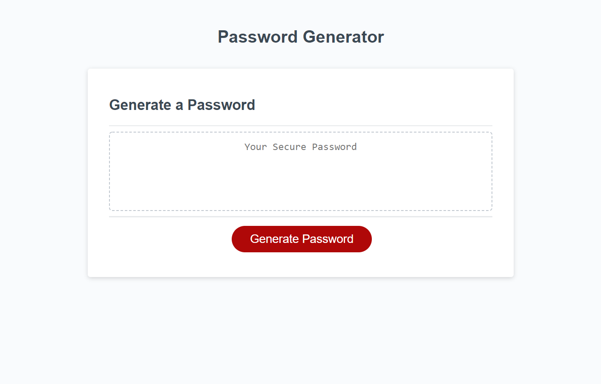

# PasswordGenerator

## Objective
The purpose of this project was to make a password generator depending on input options from the user. The password will be random and only include characters of the user's choice.

## Screenshot

 

## Link to Final Page
[Password Generator link to final page]() 

[Github Repo]()
